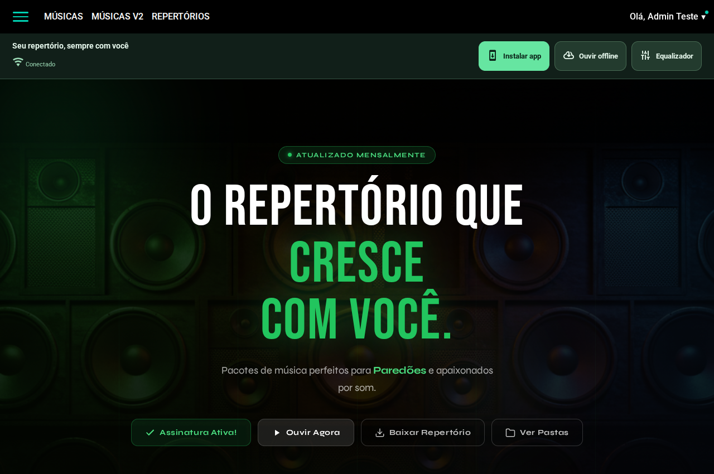
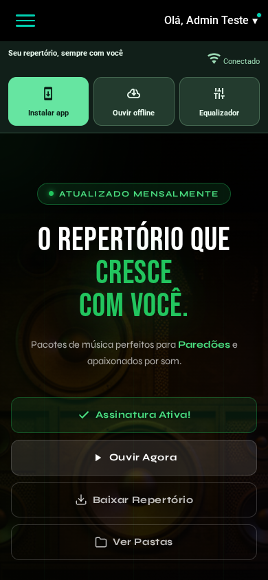
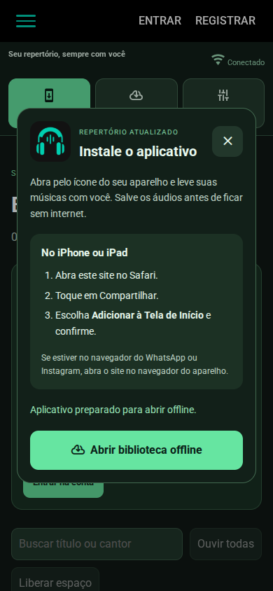
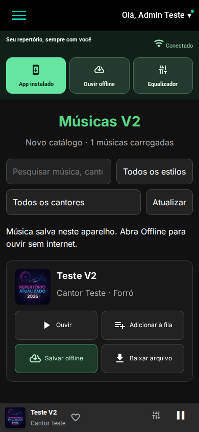
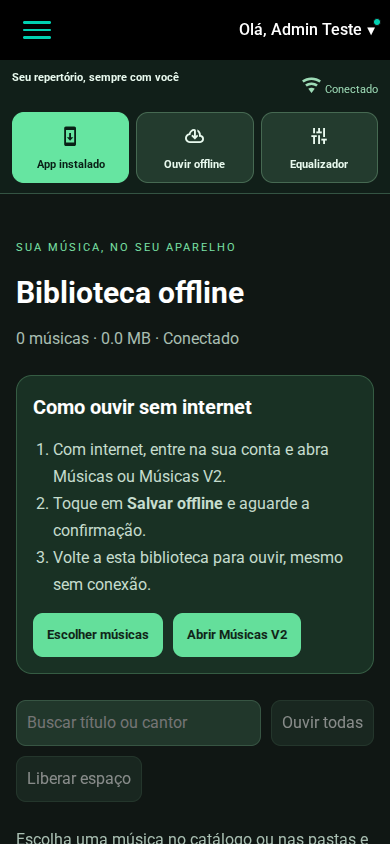
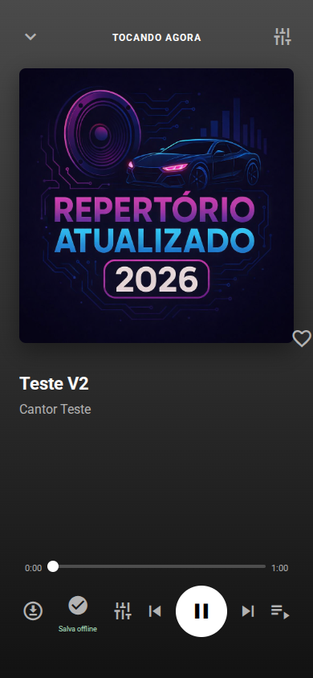
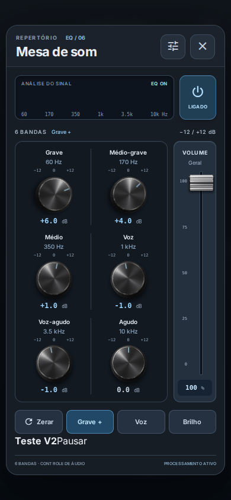

# Revisão dos controles e das telas

As capturas abaixo foram feitas nesta revisão, com dados fictícios nos emuladores. A base visual do site foi preservada. A prioridade foi tornar as funções solicitadas fáceis de encontrar e acessíveis durante a navegação.

## 1. Computador — aprovado

Instalar app, Ouvir offline e Equalizador aparecem logo abaixo do menu, com texto. A barra acompanha a página ao rolar. Antes, instalação/offline eram atalhos pequenos sobre o conteúdo.

## 2. Celular — aprovado

Os três controles aparecem por escrito em uma linha de botões. A validação conferiu limites da tela, altura mínima de toque e se cada botão podia receber o clique sem ser coberto. Atalhos flutuantes que cobriam ações foram retirados; suporte continua no menu e junto ao rodapé.

## 3. Instalação — fluxo da interface aprovado

O botão abre uma tela com instruções e o convite nativo quando o navegador o oferece. O código foi validado com eventos de instalação simulados, inclusive o evento de conclusão durante o convite. A instalação real no sistema do aparelho depende do navegador e precisa ser conferida no dispositivo.

## 4. iPhone/iPad — instruções aprovadas

A interface orienta Safari → Compartilhar → Adicionar à Tela de Início. Essa captura foi feita no Chromium com identificação iOS simulada; não representa um teste em Safari real.

## 5. Músicas V2 — aprovado

Ouvir, Adicionar à fila, Salvar offline e Baixar arquivo têm texto. O teste salvou a faixa pelo botão do catálogo e depois reproduziu a cópia sem internet. O estado “App instalado” nesta captura foi produzido pelo evento simulado do teste.

## 6. Biblioteca offline — aprovado

A biblioteca vazia explica como preparar os áudios e oferece acesso aos dois catálogos. Com músicas salvas, mostra as faixas da conta, espaço utilizado, busca, fila e remoção. O teste reabriu a página sem rede e reproduziu faixas normais e V2 por Blob local.

## 7. Player no celular — aprovado

Ao expandir o player, a ação offline tem legenda e o equalizador continua acessível. Fechar o player volta à navegação sem parar a música.

## 8. Equalizador — aprovado

A mesa abre acima do player expandido e mantém os ajustes ao trocar de rota. A validação conferiu uma única fonte Web Audio durante todos esses caminhos. Os controles também funcionam com as cópias salvas offline.

## Limites da conferência

Capturas e testes de interação não comprovam conformidade completa de acessibilidade. Foram conferidos os controles principais, nomes acessíveis, visibilidade e áreas de toque. Safari real, Android/iOS em aparelho, instalação no sistema, tela bloqueada e política de suspensão do áudio dependem da validação nos dispositivos.

O áudio B2 informado respondeu sem CORS para localhost; essa configuração remota não pôde ser alterada nesta execução. A correção no computador está em `CORRIGIR-PLAYER-CORS.md`. As configurações de armazenamento não são solucionadas apenas pelo layout do site.
